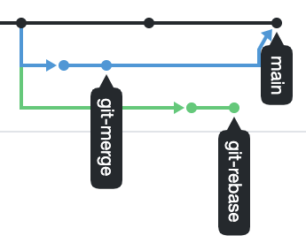
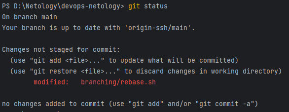

# Автор: Яковлев Артем FOPS-22

# Домашнее задание к занятию «Ветвления в Git»

### Цель задания

В процессе работы над заданием вы потренируетесь делать merge и rebase. В результате вы поймете разницу между ними и научитесь решать конфликты.   

Обычно при нормальном ходе разработки выполнять `rebase` достаточно просто. 
Это позволяет объединить множество промежуточных коммитов при решении задачи, чтобы не засорять историю. Поэтому многие команды и разработчики предпочитают такой способ.   


### Инструкция к заданию

1. В личном кабинете отправьте на проверку ссылку на network графика вашего репозитория.
2. Любые вопросы по решению задач задавайте в чате учебной группы.


### Дополнительные материалы для выполнения задания

1. Тренажёр [LearnGitBranching](https://learngitbranching.js.org/), где можно потренироваться в работе с деревом коммитов и ветвлений. 

------

## Задание «Ветвление, merge и rebase»  

**Шаг 1.** Предположим, что есть задача — написать скрипт, выводящий на экран параметры его запуска. 
Давайте посмотрим, как будет отличаться работа над этим скриптом с использованием ветвления, merge и rebase. 

Создайте в своём репозитории каталог `branching` и в нём два файла — `merge.sh` и `rebase.sh` — с 
содержимым:

```bash
#!/bin/bash
# display command line options

count=1
for param in "$*"; do
    echo "\$* Parameter #$count = $param"
    count=$(( $count + 1 ))
done
```

Этот скрипт отображает на экране все параметры одной строкой, а не разделяет их.

**Шаг 2.** Создадим коммит с описанием `prepare for merge and rebase` и отправим его в ветку main. 

#### Подготовка файла merge.sh 
 
**Шаг 1.** Создайте ветку `git-merge`. 

**Шаг 2**. Замените в ней содержимое файла `merge.sh` на:

```bash
#!/bin/bash
# display command line options

count=1
for param in "$@"; do
    echo "\$@ Parameter #$count = $param"
    count=$(( $count + 1 ))
done
```

**Шаг 3.** Создайте коммит `merge: @ instead *`, отправьте изменения в репозиторий.  
**Шаг 4.** Разработчик подумал и решил внести ещё одно изменение в `merge.sh`:
 
```bash
#!/bin/bash
# display command line options

count=1
while [[ -n "$1" ]]; do
    echo "Parameter #$count = $1"
    count=$(( $count + 1 ))
    shift
done
```

Теперь скрипт будет отображать каждый переданный ему параметр отдельно. 

**Шаг 5.** Создайте коммит `merge: use shift` и отправьте изменения в репозиторий. 

#### Изменим main  

**Шаг 1.** Вернитесь в ветку `main`. 
**Шаг 2.** Предположим, что пока мы работали над веткой `git-merge`, кто-то изменил `main`. Для этого
изменим содержимое файла `rebase.sh` на:

```bash
#!/bin/bash
# display command line options

count=1
for param in "$@"; do
    echo "\$@ Parameter #$count = $param"
    count=$(( $count + 1 ))
done

echo "====="
```

В этом случае скрипт тоже будет отображать каждый параметр в новой строке. 

**Шаг 3.** Отправляем изменённую ветку `main` в репозиторий.

#### Подготовка файла rebase.sh  

**Шаг 1.** Предположим, что теперь другой участник нашей команды не сделал `git pull` либо просто хотел ответвиться не от последнего коммита в `main`, а от коммита, когда мы только создали два файла
`merge.sh` и `rebase.sh` на первом шаге.  
Для этого при помощи команды `git log` найдём хеш коммита `prepare for merge and rebase` и выполним `git checkout` на него так:
`git checkout 8baf217e80ef17ff577883fda90f6487f67bbcea` (хеш будет другой).
**Шаг 2.** Создадим ветку `git-rebase`, основываясь на текущем коммите. 
**Шаг 3.** И изменим содержимое файла `rebase.sh` на следующее, тоже починив скрипт, но немного в другом стиле:

```bash
#!/bin/bash
# display command line options

count=1
for param in "$@"; do
    echo "Parameter: $param"
    count=$(( $count + 1 ))
done

echo "====="
```

**Шаг 4.** Отправим эти изменения в ветку `git-rebase` с комментарием `git-rebase 1`.

**Шаг 5.** И сделаем ещё один коммит `git-rebase 2` с пушем, заменив `echo "Parameter: $param"` на `echo "Next parameter: $param"`.

#### Промежуточный итог  

Мы сэмулировали типичную ситуации в разработке кода, когда команда разработчиков работала над одним и тем же участком кода, и кто-то из разработчиков 
предпочитает делать `merge`, а кто-то — `rebase`. Конфликты с merge обычно решаются просто, 
а с rebase бывают сложности, поэтому давайте смержим все наработки в `main` и разрешим конфликты. 

Если всё было сделано правильно, то на странице `network` в GitHub, находящейся по адресу 
`https://github.com/ВАШ_ЛОГИН/ВАШ_РЕПОЗИТОРИЙ/network`, будет примерно такая схема:
  


#### Merge

Сливаем ветку `git-merge` в main и отправляем изменения в репозиторий, должно получиться без конфликтов:

```bash
$ git merge git-merge
Merge made by the 'recursive' strategy.
 branching/merge.sh | 5 +++--
 1 file changed, 3 insertions(+), 2 deletions(-)
$ git push
#!/bin/bash
Enumerating objects: 1, done.
Counting objects: 100% (1/1), done.
Writing objects: 100% (1/1), 223 bytes | 223.00 KiB/s, done.
Total 1 (delta 0), reused 0 (delta 0), pack-reused 0
```  

В результате получаем такую схему:
  


#### Rebase

**Шаг 1.** Перед мержем ветки `git-rebase` выполним её `rebase` на main. Да, мы специально создали ситуацию с конфликтами, чтобы потренироваться их решать. 
**Шаг 2.** Переключаемся на ветку `git-rebase` и выполняем `git rebase -i main`. 
В открывшемся диалоге должно быть два выполненных коммита, давайте заодно объединим их в один, 
указав слева от нижнего `fixup`. 
В результате получаем:

```bash
$ git rebase -i main
Auto-merging branching/rebase.sh
CONFLICT (content): Merge conflict in branching/rebase.sh
error: could not apply dc4688f... git 2.3 rebase @ instead *
Resolve all conflicts manually, mark them as resolved with
"git add/rm <conflicted_files>", then run "git rebase --continue".
You can instead skip this commit: run "git rebase --skip".
To abort and get back to the state before "git rebase", run "git rebase --abort".
Could not apply dc4688f... git 2.3 rebase @ instead *
``` 

Если посмотреть содержимое файла `rebase.sh`, то увидим метки, оставленные Git для решения конфликта:

```bash
cat rebase.sh
#!/bin/bash
# display command line options
count=1
for param in "$@"; do
<<<<<<< HEAD
    echo "\$@ Parameter #$count = $param"
=======
    echo "Parameter: $param"
>>>>>>> dc4688f... git 2.3 rebase @ instead *
    count=$(( $count + 1 ))
done
```

**Шаг 3.** Удалим метки, отдав предпочтение варианту:

```bash
echo "\$@ Parameter #$count = $param"
```

**Шаг 4.** Сообщим Git, что конфликт решён `git add rebase.sh` и продолжим rebase `git rebase --continue`.

**Шаг 5.** Опять получим конфликт в файле `rebase.sh` при попытке применения нашего второго коммита. Давайте разрешим конфликт, оставив строчку `echo "Next parameter: $param"`.

**Шаг 6.** Далее опять сообщаем Git о том, что конфликт разрешён — `git add rebase.sh` — и продолжим rebase — `git rebase --continue`.

В результате будет открыт текстовый редактор, предлагающий написать комментарий к новому объединённому коммиту:

```
# This is a combination of 2 commits.
# This is the 1st commit message:

Merge branch 'git-merge'

# The commit message #2 will be skipped:

# git 2.3 rebase @ instead * (2)
```

Все строчки, начинающиеся на `#`, будут проигнорированны. 

После сохранения изменения Git сообщит:

```
Successfully rebased and updated refs/heads/git-rebase
```

**Шаг 7.** И попробуем выполнить `git push` либо `git push -u origin git-rebase`, чтобы точно указать, что и куда мы хотим запушить. 

Эта команда завершится с ошибкой:

```bash
git push
To github.com:andrey-borue/devops-netology.git
 ! [rejected]        git-rebase -> git-rebase (non-fast-forward)
error: failed to push some refs to 'git@github.com:andrey-borue/devops-netology.git'
hint: Updates were rejected because the tip of your current branch is behind
hint: its remote counterpart. Integrate the remote changes (e.g.
hint: 'git pull ...') before pushing again.
hint: See the 'Note about fast-forwards' in 'git push --help' for details.
```

Это произошло, потому что мы пытаемся перезаписать историю. 

**Шаг 8.** Чтобы Git позволил нам это сделать, добавим флаг `force`:

```bash
git push -u origin git-rebase -f
Enumerating objects: 10, done.
Counting objects: 100% (9/9), done.
Delta compression using up to 12 threads
Compressing objects: 100% (4/4), done.
Writing objects: 100% (4/4), 443 bytes | 443.00 KiB/s, done.
Total 4 (delta 1), reused 0 (delta 0), pack-reused 0
remote: Resolving deltas: 100% (1/1), completed with 1 local object.
To github.com:andrey-borue/devops-netology.git
 + 1829df1...e3b942b git-rebase -> git-rebase (forced update)
Branch 'git-rebase' set up to track remote branch 'git-rebase' from 'origin'.
```

**Шаг 9**. Теперь можно смержить ветку `git-rebase` в main без конфликтов и без дополнительного мерж-комита простой перемоткой: 

```
$ git checkout main
Switched to branch 'main'
Your branch is up to date with 'origin/main'.

$ git merge git-rebase
Updating 6158b76..45893d1
Fast-forward
 branching/rebase.sh | 3 +--
 1 file changed, 1 insertion(+), 2 deletions(-)
```

*В качестве результата работы по всем заданиям приложите ссылку на .md-файл в вашем репозитории.*
 
----

## Решение 1.

**Шаг 1.** 
Создал каталог branching и файлы merge.sh и rebase.sh с содержимым: 


**Шаг 2.** Создал коммит с описанием prepare for merge and rebase и отправим его в ветку main:


#### Подготовка файла merge.sh 

**Шаг 1.** Создал ветку git-merge:


**Шаг 2.** Заменил содержимое файла merge.sh на указанный в задании скрипт:


**Шаг 3.** Создал коммит "merge: @ instead *" и запушил изменения в репозиторий:


**Шаг 4.** Вношу изменения в файл merge.sh.

**Шаг 5.** Создаю коммит merge: use shift и отправляю изменения в репозиторий:


#### Изменим main

**Шаг 1.** Вернулся в ветку main:


**Шаг 2.** Изменил содержимое файла rebase.sh:



**Шаг 3.** Отправил изменения в ветку main:


#### Подготовка файла rebase.sh

**Шаг 1.** С помощью команды git log нахожу хеш коммита prepare for merge and rebase и выполняю git checkout на него:


**Шаг 2.** Создал ветку git-rebase, основываясь на текущем коммите:


**Шаг 3.** Изменил содержимое файла rebase.sh.

**Шаг 4.** Отправил эти изменения в ветку git-rebase с комментарием git-rebase 1:


**Шаг 5.** Сделал ещё один коммит git-rebase 2 с пушем, заменив echo "Parameter: $param" на echo "Next parameter: $param":


#### Merge

Переключаюсь на ветку main. Сливаем ветку git-merge в main и отправляем изменения в репозиторий:


#### Rebase

**Шаг 1. и Шаг 2.** Выполнил rebase ветки git-rebase на main, создав конфликт:


Смотрю содержимое файла rebase.sh и действительно, вижу метки, оставленные Git для решения конфликта:


**Шаг 3.** Удаляю метки, выбираю вариант echo "\$@ Parameter #$count = $param"

**Шаг 4.** Сообщаю Git, что конфликт решён и продолжаю rebase.

**Шаг 5.** Опять получаю конфликт:


Редактирую файл rebase.sh, оставляю строчку echo "Next parameter: $param".

**Шаг 6.** Снова сообщаю Git о том, что конфликт разрешён и продолжаю rebase.

Открывается текстовый редактор, предлагающий написать комментарий к новому объединённому коммиту:


После решения конфликта Git сообщил:


**Шаг 7.** Пытаюсь выполнить пуш и вижу, что команда завершается с ошибкой:


Это происходит потому, что я пытаюсь перезаписать историю.

**Шаг 8.** Пытаюсь выполнить пуш с флагом force и это удается сделать:


**Шаг 9.** Смержу ветку git-rebase в main простой перемоткой:


 Итоговое изображение:

Ссылка на итоговый network график: https://github.com/temagraf/netgit2/network
